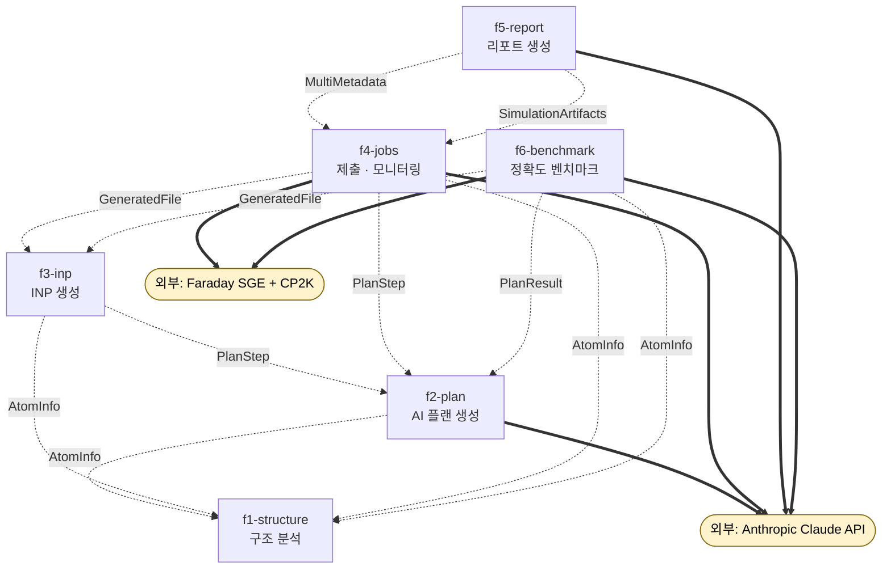
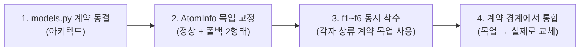

# ARCHITECTURE.md — CP2K 시뮬레이션 에이전트 백엔드

## 1. 제품 한 줄 요약

> **CIF 업로드 → AI 플랜 → CP2K 입력 생성 → SGE 클러스터 제출/자가치유 → 리포트.**

사용자가 결정 구조(CIF) 파일을 업로드하면, AI(Anthropic Claude)가 멀티스텝 DFT 시뮬레이션 플랜을 설계하고, 그 플랜으로 CP2K 입력 파일(`.inp`)을 생성한 뒤, Faraday SGE 클러스터에 작업을 제출한다. 실행 중 실패가 발생하면 자가치유 엔진이 로그를 진단해 입력을 자동 수정·재시도하며, 완료된 작업은 12종 물성과 총에너지를 추출한 마크다운 리포트로 정리된다. 별도의 정확도 벤치마크 엔진이 12단계 공식 기준값 대비 에이전트의 정확도를 검증한다.

---

## 2. 기능 지도 (Feature Map)

| id | name_ko | 책임 (Responsibility) | 담당 엔드포인트 | 소유 모듈 |
|----|---------|----------------------|----------------|----------|
| **f1-structure** | 구조 분석 | CIF(bytes)를 ASE로 파싱해 원자/격자/원소 + SMEAR 권장값을 담은 정규화 `atom_info`(SSOT)를 생성한다. CIF 본문 SHA-256 해시(`content_hash`)로 동일 입력을 식별한다. | `POST /analyze-cif` | `app/features/structure/` |
| **f2-plan** | AI 시뮬레이션 플랜 생성 | `atom_info` + DFT 파라미터를 받아 2단계 Claude 호출(키워드 추출 → 정밀 설계)로 멀티스텝 플랜(`steps` + `expert_tip`)을 생성한다. 항상 `req.atom_info`를 결과에 에코해 SSOT를 동기화한다. `active_tokens`는 `req`(PlanRequest) 동적 속성에서 읽는다. | `POST /generate-plan` | `app/features/plan/` |
| **f3-inp** | CP2K 입력파일(INP) 생성 | 플랜 `steps`(selected/exclude 필터)와 `atom_info`로 스텝별 `build_full_inp`를 호출해 `.inp` 텍스트를 생성한다. `multi_atom_info`가 2개 이상이면 구조별 개별 파일을 만든다. 옵션 트리는 schema_engine 거버넌스와 self_healing 검증을 거친다. | `POST /generate-inp` | `app/features/inp/` |
| **f4-jobs** | 작업 제출 및 모니터링 | 생성된 `.inp`(또는 자동 생성)와 파라미터로 SGE(qsub)에 스위트를 제출하고, qstat 폴링으로 실시간 상태를 모니터링하며, 실패 시 self_healing으로 자동 재시도하고 단계 간 좌표를 체이닝한다. 다중구조 시 `multi_metadata.json`을 기록하고 상태를 `job_status.json`에 영속화한다. | `POST /submit-job`<br>`GET /job-live-status/{job_key:path}`<br>`POST /job-stop`<br>`GET /download-job/{job_name}` | `app/features/jobs/` |
| **f5-report** | 결과 리포트 생성 | 완료된 `job_dir`를 walk하며 `.out/.pdos/.bs` 로그에서 12종 물성과 총에너지를 정규식+AI 폴백으로 추출하고, `multi_metadata.json` 유무에 따라 단일/다중 비교 마크다운 리포트를 LLM(또는 폴백 템플릿)으로 생성한다. 지원 물성 12종은 `{geo_opt, single_point, dos, band, aimd, vibrational, neb, adsorption, work_function, hirshfeld, absorption, emission}`로, f6 벤치마크 레벨 12(`hirshfeld`) 산출물도 분석 가능하다. **JobStatus나 orchestrator는 소비하지 않는다.** | `POST /generate-report` | `app/features/report/` |
| **f6-benchmark** | 정확도 벤치마크 엔진 | `test/level1~12`의 공식 CIF/INP를 진실값으로 삼아 CIF 분석 → AI 플랜 → INP 빌드 → SGE/로컬 실행 → 자가치유 재시도(최대 3회) → 공식 결과 대비 오차 비교를 12단계로 수행하고, 실시간 진행상태와 레벨별 정확도 리포트를 제공한다. | `POST /api/benchmark/run`<br>`GET /api/benchmark/status` | `app/features/benchmark/` |

> 엔드포인트는 총 10개이며 각각 정확히 1개 기능에 배정된다.

---

## 3. 의존성 그래프 (Dependency Graph)

기능 간 **계약 의존**을 mermaid flowchart로 표현한다.

- 화살표 **라벨 = `via_contract`** (해당 계약을 통해 의존한다는 의미).
- **점선 화살표 = `can_mock=true`** (목업으로 우회 가능, 무차단 병렬 개발 지점). 본 시스템의 모든 기능 간 엣지는 `can_mock=true`이므로 전부 점선이다.



> 화살표 방향은 "의존하는 쪽 → 의존받는 쪽"(소비자 → 생산자)이다. 예) `f3 -. "AtomInfo" .-> f1` 은 "f3-inp가 AtomInfo 계약을 통해 f1-structure에 의존한다"는 뜻이다. 데이터 흐름(생산 → 소비)은 화살표의 역방향(f1 → … → f5)이다.

**기능 레벨 순환 의존은 없다** (`f1 → f2 → f3 → f4 → f5` 단방향, f6는 `f1/f2/f3`를 소비하는 말단). 단, *모듈 레벨* 순환은 존재하며 4절 동결 규약으로 관리한다.

---

## 4. 공유 모듈과 소유 전략

여러 기능이 함께 쓰는 코드는 **공유 모듈**로 분리하고, 각 모듈에 단일 오너를 둔다. 안정 API(시그니처 동결) 표시가 있는 함수는 PR 리뷰 없이 시그니처를 바꾸지 않는다.

| 모듈 | 목적 | 사용 기능 | 소유 / 안정 API |
|------|------|----------|----------------|
| `app/schemas/common.py` (+ `features/*/schemas.py`) | 4개 요청 Pydantic 모델(`PlanRequest`/`InpRequest`/`SubmitRequest`/`BenchmarkRequest`) + `FileItem`. 모든 엔드포인트 경계 계약의 코드상 원천. | f2, f3, f4, f6 | **아키텍트/리드 소유.** 계약 변경은 전 기능에 영향 → PR 리뷰 필수. |
| `app/features/inp/service.py` 외 (`app/shared/options.py`·`physics_patterns.py`, 플랜은 `app/features/plan/service.py`) | AI 플랜 생성(`generate_plan_logic`), INP 렌더링(`generate_inp_logic`/`build_full_inp`), 경로옵션 파싱(`parse_path_based_options`), 중첩병합(`deep_merge`), 물리정규식(`PHYSICS_PATTERNS`). | f2, f3, f4, f5, f6 | **f3-inp 소유.** `build_full_inp` / `parse_path_based_options` / `PHYSICS_PATTERNS`는 안정 API로 동결. |
| `app/features/plan/prompts.py` · `app/features/report/prompts.py` | Anthropic system 프롬프트 4종(`KEYWORD_EXTRACTION`/`UNIFIED`/`REPORT`/`COMPARATIVE_REPORT`). 순수 문자열 상수. | f2, f5 | 각 소비 기능이 **자기 프롬프트 섹션을 소유**(f2=플랜, f5=리포트). 플레이스홀더 토큰명은 계약으로 고정. |
| `app/shared/schema_engine.py` | CP2K 입력 XML 스키마 인덱싱·검증·정규화·재배치·렌더링 엔진(`CP2KSchemaEngine` + 싱글톤). `cp2k_input.xml`(~34MB)/`cache.pkl`/`basis_map.json` 로드. | f3, f4, f6 | **CP2K 도메인 전담 오너 소유.** `validate_and_relocate` / `dict_to_tree_schema_aware` / `get_manual_snippet` / `resolve_files`는 안정 API. |
| `app/shared/self_healing.py` | 실패 진단(`diagnose`) → 지식베이스/Claude 자동수정(`heal`/`heal_with_ai`) → 검증(`validate_and_correct`) → 성공 학습(`record_success`). `healing_knowledge.json` 영속. | f3, f4, f6 | **f4-jobs 소유.** `validate_and_correct` / `diagnose` / `heal` 시그니처 동결. |
| `app/shared/physics_rules.py` | CP2K 옵션 dict in-place 물리 모순 자동교정(`apply_physics_rules`) + SCF 실패 단계별 처방(`apply_scf_repair`). 순수 규칙 엔진. | f3, f4, f6 (self_healing/schema_engine 경유 간접) | schema_engine 오너 또는 f4-jobs 오너 공동 관리. |
| `app/core/sge.py` (`SGE_TEMPLATE`) | SGE qsub용 `run.sh` 셸 템플릿(큐 gp3, PE 16cpu, CP2K_ROOT, Intel oneAPI mpiexec, venv 경로). | f4, f6 | **f4-jobs 소유.** 클러스터 환경 변경 시 단일 지점 수정. |
| `app/features/structure/service.py` | CIF 파싱(ASE) → `atom_info` 생성 + `content_hash`(SHA-256) 계산. `/analyze-cif`가 사용. | f1 | **f1-structure 전용.** |
| `app/main.py` (FastAPI app) | app 인스턴스, CORS, `RequestValidationError` 핸들러, 로그필터 미들웨어, `../frontend` SPA 정적 마운트. | 전 기능 | **app 부트스트랩/미들웨어/정적서빙은 아키텍트 소유.** 각 엔드포인트는 기능 오너가 라우터로 등록. APIRouter 분리 권장(병렬 충돌 최소화). |

### 모듈 순환 의존 동결 규약 (부팅 안정성)

`generator` ↔ `self_healing` ↔ `schema_engine` 사이에는 **모듈 레벨 순환**이 존재하며, **지연(함수 내부) import로만 해소**된다. 어떤 오너도 다음을 top-level로 승격하지 말 것:

- `self_healing.py`의 `from generator import ...`(`parse_path_based_options`/`build_full_inp`/`schema_engine`) — 함수 내부 전용.
- `generator.build_full_inp` 내부의 `from self_healing import healing_engine` — 함수 내부 전용.

> 이 import 패턴 자체가 동결 규약이다. top-level로 올리면 import 시점 순환으로 **서버 부팅이 깨진다**. (소유권 분산: generator=f3, self_healing=f4, schema_engine=전담.)

---

## 백엔드 폴더 구조 (package-by-feature)

위 공유 모듈/소유 전략을 디렉토리로 구현하면 다음과 같다. 기능별 코드는 `app/features/<id>/`로 묶고, 여러 기능이 공유하는 도메인 엔진/유틸은 `app/shared/`로, 경계 계약은 `app/schemas/`로 분리한다.

```
backend/
  app/
    main.py                  # FastAPI 앱: 라우터 등록, 미들웨어, 정적 서빙 (얇게)
    core/
      config.py              # env/설정
      sge.py                 # SGE_TEMPLATE + qsub 래퍼 (구 orchestrator의 SGE 부분)
      llm.py                 # Anthropic 클라이언트 래퍼
    schemas/
      common.py              # cross-feature 계약 = data-models.md 의 코드본
    shared/                  # 여러 기능이 공유하는 도메인 엔진/유틸
      schema_engine.py
      self_healing.py
      physics_rules.py
      options.py             # parse_path_based_options, merge_custom_options, deep_merge
      physics_patterns.py    # PHYSICS_PATTERNS
    features/
      structure/   router.py  service.py  schemas.py            # f1 (CIF 분석)
      plan/        router.py  service.py  schemas.py  prompts.py # f2
      inp/         router.py  service.py  schemas.py            # f3 (build_full_inp 소유)
      jobs/        router.py  service.py  schemas.py            # f4 (구 orchestrator)
      report/      router.py  service.py  schemas.py  prompts.py # f5
      benchmark/   router.py  service.py  schemas.py            # f6
```

각 기능 폴더는 세 역할로 일관되게 나뉜다: `router.py`는 엔드포인트(HTTP 경계)만 정의해 요청을 받고 `service.py`를 호출하는 얇은 층이고, `service.py`는 해당 기능의 실제 비즈니스 로직(분석/생성/제출/리포트)을 담으며, `schemas.py`는 그 기능 고유의 요청·응답 모양을 둔다(cross-feature 계약은 `app/schemas/common.py`에 둔다). 원칙은 **한 기능 = 한 폴더 = 한 명 소유**로, 2절 기능 지도의 오너가 자기 폴더 전체(router/service/schemas)를 책임지므로 병렬 작업 시 충돌 지점이 폴더 경계로 국소화된다.
<!-- 계약(엔드포인트+데이터 모양)은 구조 변경과 무관하게 불변이며, 바뀌는 것은 구현 위치뿐이다. -->

---

## 5. 병렬 개발 전략 (계약 기반 무차단 개발)

핵심 원칙: **모든 기능 간 의존 엣지가 `can_mock=true`** 이다. 따라서 각 팀은 상류 기능의 실제 구현을 기다리지 않고, 상류가 약속한 **계약(Contract)의 목업**만으로 즉시 자기 기능을 개발·테스트할 수 있다.

### 5.1 무차단의 근거 — 계약이 곧 인터페이스

기능 간에는 코드 호출이 아니라 **데이터 계약(dict/JSON 형태)** 으로만 결합된다. 소비자는 생산자의 내부 구현을 모른 채 계약 형태만 신뢰하면 된다(대부분 `.get`으로 방어적으로 읽음). 따라서 계약 형태만 합의되면 양쪽을 동시에 짤 수 있다.

### 5.2 목업 우선 개발 순서



1. **`models.py` 계약 먼저 동결** — 4개 요청 모델과 `FileItem`이 모든 경계의 원천이므로 아키텍트가 가장 먼저 고정한다. 이것이 모든 팀의 출발 신호다.
2. **AtomInfo(SSOT) 목업 고정** — 파이프라인 전체에 실리는 단일 진실 소스. **두 가지 형태만** 목업하면 충분하다:
   - 정상 경로 형태(모든 키 포함).
   - 폴백 형태(`atom_count==0` + `error` 키, 키 집합이 정상과 다름).
   > 세 번째(empty-CIF 폴백)도 키 집합이 다르나, 소비자가 선택적 키를 모두 `.get`으로 읽으면 두 형태 목업으로 커버된다.
3. **f1~f6 동시 착수** — 각 팀이 상류 계약의 목업을 들고 개발:
   - **f2/f3/f4/f6** → `AtomInfo` 목업.
   - **f3/f4** → `PlanStep` 목업 (`run_type`/`inp_options`/`selected`/`exclude`만 있으면 동작).
   - **f4/f6** → `GeneratedFile` 목업 (`{filename, content}`만 필요).
   - **f5** → `SimulationArtifacts` 목업: 샘플 `.out` + (선택) `.pdos`/`.bs` + (선택) `multi_metadata.json`을 `simulations/{dir}/`에 두기만 하면 **SGE/오케스트레이터(f4) 없이** 리포트를 개발할 수 있다. **JobStatus 목업은 불필요**(f5는 JobStatus를 소비하지 않음).
   - **f6** → `PlanResult` 목업(steps + expert_tip + 에코된 atom_info).
4. **계약 경계에서 통합** — 각 목업을 상류의 실제 출력으로 한 곳씩 교체한다. 통합 지점은 정확히 의존 엣지(3절 그래프의 점선)이며, 형태가 계약과 같으므로 교체는 국소적이다.

### 5.3 통합 순서 (권장)

데이터 흐름을 따라 상류부터 실제화한다: **f1 → f2 → f3 → f4 → f5**. f6는 f1/f2/f3가 실제화되면 자연히 합류한다. f5는 f4의 실제 디스크 산출물(`SimulationArtifacts` + `MultiMetadata`)이 생기는 순간 합류하며, 그 전까지는 샘플 파일로 완전 독립 개발이 가능하다.

### 5.4 계약 드리프트 방지 (clean 재설계 메모, 권장·비강제)

- 4개 요청 모델의 공유 DFT 파라미터(~20개)를 공통 베이스 `DftParams`로 추출하면 드리프트를 막는다. (현재 `SubmitRequest`만 기본값이 다름: cutoff=400.0 / rel_cutoff=50.0 / functional=PBE.)
- `job_key` 규칙(`'simulations/'` 경로 `/`→`_` 치환)은 f4 내부 세부지만 f5가 디렉토리 해석에 의존하므로, `MultiMetadata.sub_jobs[].job_key`/`filename`을 신뢰 경로로 계약화한다(**f5는 job_key를 역추론하지 말 것**).

---

## 6. 외부 시스템

| 외부 시스템 | 연동 기능 | 용도 / 설정 |
|------------|----------|------------|
| **Anthropic Claude API** | f2(직접), f5(직접), f4·f6(간접, `self_healing.heal_with_ai` / `generate_plan_logic`) | LLM 추론 엔진. f2는 2단계 호출(키워드 추출 → 정밀 설계), f5는 리포트 작성, f4/f6는 자가치유 시 입력 자동수정. 환경변수 `CLAUDE_API_KEY`, `ANTHROPIC_MODEL`(기본 `claude-sonnet-4-6`). |
| **Faraday SGE / Grid Engine** | f4(직접 제출/모니터링), f6(직접, 로컬 폴백 있음) | 작업 스케줄러. `qsub`/`qstat`/`qdel`, `SGE_ROOT=/var/lib/gridengine`, `SGE_CELL=Faraday`, 큐 `gp3`, PE `16cpu`. 셸 템플릿은 `orchestrator.SGE_TEMPLATE`(f4 소유, f6 재사용). |
| **CP2K 실행환경** | f4, f6 | DFT 계산 엔진. `CP2K_ROOT=/share/cp2k-2026.1_mkl`, Intel oneAPI `mpiexec`, venv `/DATA/lab07/hglee/cp2k_agent/venv`. f6는 로컬 `cp2k.popt` 폴백 지원. |
| **파일시스템** | f4, f5, f6 | f4: `simulations/{job}/`, `backend/job_status.json`. f5: `simulations/{job_dir}/`의 `.out/.pdos/.bs/multi_metadata.json`. f6: `test/level{N}/`, `simulations/benchmark_{timestamp}/`. |
| **ASE** | f1 | CIF 파싱(`ase.io.read(format='cif')`)으로 `atom_info` 생성. |

### 외부 시스템 관련 운영 메모

- **폴링/타임아웃**: f4는 qstat 폴링으로 실시간 상태를 갱신한다. f6는 폴링 300회 × 5초(≈25분) 타임아웃.
- **단위 변환 상수**(f5): a.u.→eV `×27.2114`, E→nm `1239.84/E`.
- **`.out` 파싱 규칙**(f5): 총에너지는 `ENERGY| Total FORCE_EVAL ...`, 12종 물성은 `PHYSICS_PATTERNS` 정규식. `-r-`/`BAND` 접두 `.out`은 단일 리포트 walk에서 제외.

---

## 부록 — 핵심 데이터 계약 (요약)

전체 파이프라인을 흐르는 주요 계약과 그 생산자/소비자:

| 계약 | 생산자 | 소비자 | 비고 |
|------|--------|--------|------|
| `AtomInfo` | f1 | f2, f3, f4, f6 | **SSOT.** 정상/parse-failure 폴백/empty-CIF 폴백의 키 집합이 서로 다름 → 선택적 키는 반드시 `.get`. |
| `PlanStep` | f2 | f3, f4, f6 | `active_tokens`는 **두 소비처가 다름**: 플랜 생성=`req` 동적 속성, inp/제출=`step` 키(`app/features/jobs/service.py`). |
| `GeneratedFile` | f3 | f4, f6 | `{filename, content}` 핵심. `validation_logs`는 제출 측 `FileItem`에만. |
| `MultiMetadata` | f4 | f4, f5 | 다중구조 비교 리포트 트리거. f5가 디스크에서 직접 읽음. |
| `SimulationArtifacts` | f4 | f5 | 코드 객체가 아닌 **디스크 파일 포맷 약속**(`.out`/`.pdos`/`.bs`/`multi_metadata.json`). |
| `JobStatus` / `StepHistory` | f4 | **f4 + 프런트 모니터 전용** | ⚠️ f5는 소비하지 않음(`app/features/report/service.py` import에 jobs 로직 없음 — 코드 확인 완료). |
| `ReportData` | f5 | (말단) | 단일/다중에 따라 `summary` 형태 상이. |
| `BenchmarkReport` / `BenchmarkLevelReport` | f6 | (말단, 프런트 폴링) | 레벨→물성 매핑(1 geo_opt … 12 hirshfeld). f5 지원 물성 12종과 동일 키 집합(`hirshfeld` 포함). |
